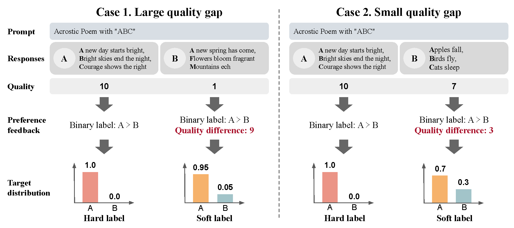

# Margin Matching Preference Optimization

Pytorch Implementation for the paper:

**[Margin Matching Preference Optimization: Enhanced Model Alignment with Granular Feedback][1]** <br>
[Kyuyoung Kim*](https://kykim0.github.io/), Ah Jeong Seo*, [Hao Liu](https://www.haoliu.ai/), [Jinwoo Shin](https://alinlab.kaist.ac.kr/shin.html), [Kimin Lee](https://sites.google.com/view/kiminlee/home) <br>
In EMNLP 2024 Findings

<!---->



Setup
--------
```
conda create -n rlhf_bench python=3.10 absl-py pyparsing pytorch torchvision torchaudio pytorch-cuda=12.1 -c pytorch -c nvidia

# check gpu
import torch
torch.cuda.is_available()

# install the remaining package dependencies
python -m pip install -e .
pip install -r requirements.txt

# install flash attention
MAX_JOBS=4 pip install flash-attn --no-build-isolation

# for deepspeed
conda install -c conda-forge mpi4py mpich
```


Dataset
--------
- [UltraFeedback](https://huggingface.co/datasets/allenai/ultrafeedback_binarized_cleaned)
- [SHP](https://huggingface.co/datasets/Ahjeong/SHP_filtered_for_MMPO)


Training
--------
- best ckpt: https://huggingface.co/Ahjeong/MMPO_Gemma_7b_gamma1.1_epoch3


Evaluation
--------
- MT-Bench
- RewardBench: [leaderboard](https://huggingface.co/spaces/allenai/reward-bench)


## Citation

```bibtex
```

License
--------
MIT License

[1]: 
