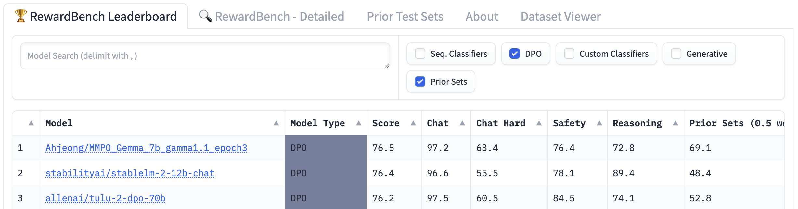

# Margin Matching Preference Optimization

Pytorch Implementation for the paper:

**Margin Matching Preference Optimization: Enhanced Model Alignment with Granular Feedback** <br>
[Kyuyoung Kim*](https://kykim0.github.io/), Ah Jeong Seo*, [Hao Liu](https://www.haoliu.ai/), [Jinwoo Shin](https://alinlab.kaist.ac.kr/shin.html), [Kimin Lee](https://sites.google.com/view/kiminlee/home) <br>
In EMNLP 2024 Findings

<!---->


Setup
--------
```
conda create -n mmpo python=3.10
# install pytorch
conda install pytorch==2.1.2 torchvision==0.16.2 torchaudio==2.1.2 pytorch-cuda=12.1 -c pytorch -c nvidia

# check gpu
import torch
torch.cuda.is_available()

# install the remaining package dependencies
python -m pip install -e .
pip install -r requirements.txt

# install flash attention
MAX_JOBS=4 pip install flash-attn --no-build-isolation

# for deepspeed
conda install -c conda-forge mpi4py mpich
```


Dataset
--------
We evaluate MMPO using both human and AI feedback data to assess their performance on feedback of varying qualities:

### 1. [UltraFeedback](https://huggingface.co/datasets/allenai/ultrafeedback_binarized_cleaned)
- For more precise evaluation, we used the filtered version released by AllenAI. Filtering details can be found in the dataset card. <br>

### 2. [SHP](https://huggingface.co/datasets/Ahjeong/SHP_filtered_for_MMPO)
- To build this [filtered version of SHP](https://huggingface.co/datasets/Ahjeong/SHP_filtered_for_MMPO), we sample uniformly across score differences to evaluate the methods over diverse quality margins.
- Following [KTO](https://github.com/ContextualAI/HALOs), we ensured that the same prompt appears no more than five times to prevent overfitting. More details can be found in `scripts/run_dpo_shp.py`.


Training
--------
If you want to access the trained checkpoint, you can download our best checkpoint here: [`MMPO_Gemma_7b_gamma1.1_epoch3`](https://huggingface.co/Ahjeong/MMPO_Gemma_7b_gamma1.1_epoch3) <br>
On the other hand, If you want to train the model yourself, follow these commands:

### DPO

- Gemma 2b:
```
accelerate launch --main_process_port=2380 --num_processes=2 --config_file recipes/accelerate_configs/multi_gpu.yaml scripts/run_dpo.py recipes/gemma-2b/dpo.yaml --bt_beta=2.2
```

- Gemma 7b:
```
accelerate launch --main_process_port=2382 --num_processes=4 --config_file recipes/accelerate_configs/deepspeed_zero3.yaml scripts/run_dpo.py recipes/gemma-7b/dpo.yaml --bt_beta=0.3
```
To train with SHP dataset, run:
```
accelerate launch --main_process_port=2381 --num_processes=4 --config_file recipes/accelerate_configs/deepspeed_zero3.yaml scripts/run_dpo_shp.py recipes/gemma-7b/dpo_shp.yaml --bt_beta=1.1
```

- Llama 8b:
```
accelerate launch --main_process_port=2383 --num_processes=4 --config_file recipes/accelerate_configs/deepspeed_zero3.yaml run_dpo.py recipes/llama-3-8b/dpo.yaml --bt_beta=2.2
```


Evaluation
--------
### 1. MT-Bench

To evaluate your model on MT-Bench dataset, follow the guidance in [FastChat](https://github.com/lm-sys/FastChat/tree/main/fastchat/llm_judge) repository. This is the performance on MT-Bench when training MMPO with UltraFeedback:

  Model  |  Gemma-2b  |  Gemma-7b  | LLaMA-8b  | 
------- | ------ | ------ | ------ | 
DPO | 6.09 | 7.40 | 7.41 |
MMPO | 6.10 | 7.53 | 7.58 |


### 2. RewardBench

To evaluate your model on RewardBench dataset, follow the guidance in [RewardBench](https://github.com/allenai/reward-bench) repository. You can also compare the performance of different models on the [leaderboard](https://huggingface.co/spaces/allenai/reward-bench). As of September 2024, MMPO achieves state-of-the-art performance compared to competing models at the same scale:




More experimental details can be found in the paper. <br>


## Citation

```bibtex
```

License
--------
Apache License

